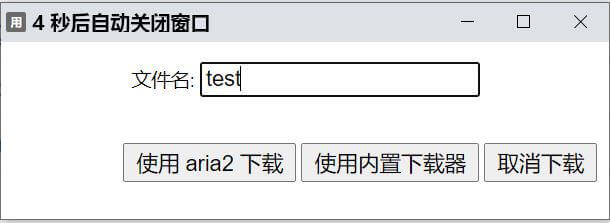

# aria2-chrome-extension

使用 aria2 接管 chrome 内置下载器

使用前先修改 「js/const.js」 中的 `aria2 config`

## 截图

## 参考

-   文章
    -   [Chrome Extension 開發與實作 19-chrome.downloads API 使用腳本管理下載](https://ithelp.ithome.com.tw/articles/10188315)
    -   [download file via chrome extension](http://www.siguoyi.com/?content/read-147.html)
-   chrome extension
    -   [Aria2 for Chrome](https://github.com/alexhua/Aria2-for-chrome)
    -   [ToAria2](https://github.com/qubic/chromaria2)
    -   [YAAW for Chrome](https://github.com/acgotaku/YAAW-for-Chrome)
